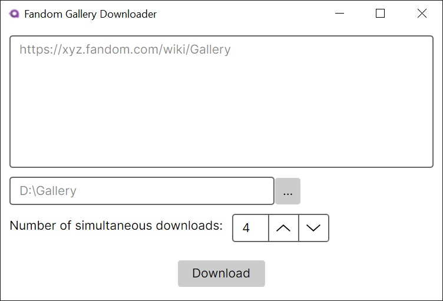

# Fandom Gallery Downloader

<div align="center">
  
</div>

## Overview

The **Fandom Gallery Downloader** is a simple tool for downloading images from Fandom websites. This program allows you to specify a list of URLs, choose the directory where the images will be saved, adjust the number of simultaneous downloads, and easily start the process with a single button.

## Features

- **Multiple URLs**: Provide a list of websites to fetch images from.
- **Custom Save Path**: Select the folder where all downloaded images will be stored.
- **Concurrent Downloads**: Adjust the number of simultaneous downloads to optimize speed.
- **User-Friendly Interface**: A clean and intuitive interface with a single "Download" button.

## Getting Started

### Download

You can download the latest version of the program from the [Releases](https://github.com/milogrove/FandomGalleryDownloader/releases/) section.

### Prerequisites

- Windows OS
- .NET 8.0
- The program can also run on Linux and macOS if compiled from source.

### Installation

1. Clone this repository:
   ```
   git clone https://github.com/milogrove/FandomGalleryDownloader.git
   ```
2. Open the project in Visual Studio.
3. Build the solution to restore dependencies and compile the application.
4. Run the application from Visual Studio or compile it to an executable file.

## Usage

1. **Input URLs**: Provide a list of URLs in the designated text field.
2. **Choose Save Path**: Specify the directory where you want to save the downloaded images.
3. **Set Concurrent Downloads** *(Optional)*: Adjust the number of simultaneous downloads for better performance.
4. **Start Downloading**: Click the "Download" button to start the process.
5. **Wait for Completion**: The program will notify you once all downloads are finished.
